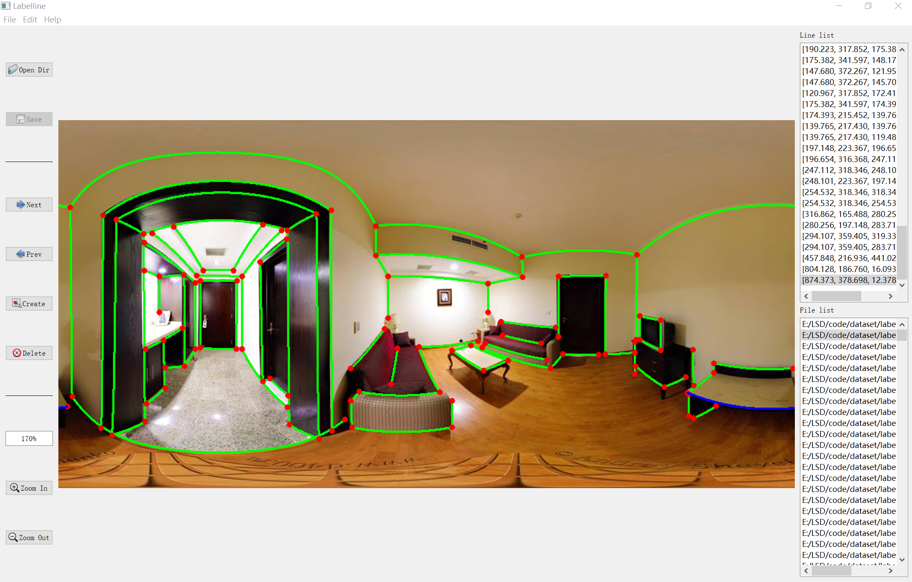

[](https://github.com/lh9171338/Outline) Labelline
===

# Introduction
This repository contains a line segment annotation tool for pinhole, fisheye, and spherical images, which is implemented with PyQt5.
In default, we use the pinhole image.
# Tutorial
Shortcut (default)
Ctrl + S: Save the annotations
Ctrl + O: Select an image folder
    D   : Go to the next image
    A   : Go to the previous image
Ctrl + C: Create a new annotation
Ctrl + X: Delete the selected annotation
Ctrl + U: View the tutorial
'Mouse buttons (clicked in the image area): 
Left button: Create an endpoint of a new annotation
Right button: Create a new annotation',
DoubleClick point: Select point

# UI

<p align="center">
    
</p> 

# Requirements

```shell
pip install -r ./requirements.txt
```

## Dataset structure

```shell
|-- dataset   
    |-- <image folder>
        |-- 000001.png  
        |-- 000002.png  
        |-- ...  
    |-- <label folder>  
        |-- 000001.mat  
        |-- 000002.mat  
        |-- ...  
    |-- <coeff folder>
        |-- 000001.yaml
        |-- 000002.yaml  
        |-- ...
```

## Usage
```
python Labelline.py --type <image type> [--coeff_file <coeff image>]
```
Please refer to [Usage.md](Usage.md) for more usage information.